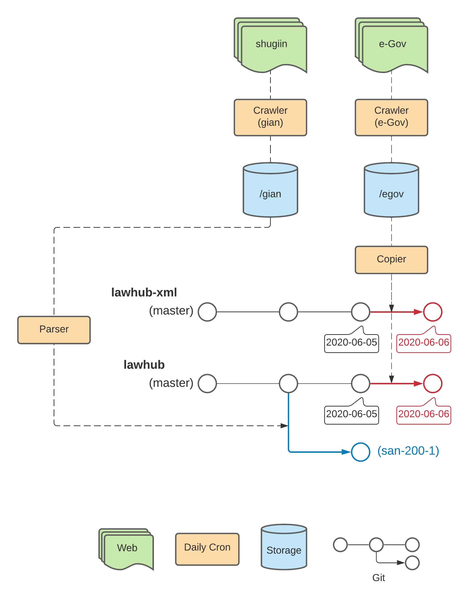

# lawhub
日本の法令データをGitHubで管理することを目的としたレポジトリです。

現在、以下の機能がサポートされています。
* [e-Govの法令データ](https://elaws.e-gov.go.jp/download/lawdownload.html)にあわせてmasterブランチを更新する
* [衆議院の議案データ](http://www.shugiin.go.jp/internet/itdb_gian.nsf/html/gian/menu.htm)にあわせてfeatureブランチを作成し、pull requestを作成する

次の機能は含みません。
* 作成したpull requestをマージする
* 議案提出者に応じてauthorを変更する

[
